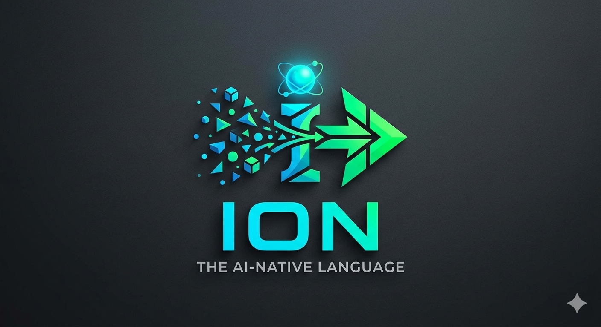

<p align="center">
  
</p>

# Ion

**A token-efficient, AI-native programming language that compiles to anything.**

Write once in Ion. Ship idiomatic JavaScript, TypeScript, Python, HTML, React JSX, Vue SFC, Lightning Web Components, Salesforce Apex, or any registered target. Ion is not a framework or a runtime — it compiles away entirely, leaving clean, human-readable output in your target language.

```ion
data User { id: Int, name: Str, email: Str, active: Bool = true }

fn get_active(users: List<User>) -> List<Str> =
  users
    |> filter(u -> u.active)
    |> map(u -> u.name)
```

Compiles to JavaScript:

```js
function getActive(users) {
  return users
    .filter(u => u.active)
    .map(u => u.name);
}
```

Compiles to TypeScript:

```ts
const getActive = (users: User[]): string[] =>
  users.filter(u => u.active).map(u => u.name);
```

Compiles to Python:

```python
def get_active(users):
    return list(map(lambda u: u.name, filter(lambda u: u.active, users)))
```

Compiles to React JSX:

```tsx
export const GetActive: React.FC = () => (
  <ul>
    {users.filter(u => u.active).map(u => <li key={u.id}>{u.name}</li>)}
  </ul>
);
```

Compiles to Lightning Web Component:

```html
<!-- getActive.html -->
<template>
  <template for:each={activeUsers} for:item="u">
    <li key={u.id}>{u.name}</li>
  </template>
</template>
```

```js
// getActive.js
import { LightningElement, track } from 'lwc';
export default class GetActive extends LightningElement {
  @track users = [];
  getActiveUsers(users) { return users.filter(u => u.active); }
}
```

Compiles to Salesforce Apex:

```apex
public with sharing class GetActiveController {
  @AuraEnabled(cacheable=true)
  public static Object getActive(Object users) {
    return users;
  }
}
```

Same Ion source. Same logic. Idiomatic output per target.

---

## Why Ion

**LLMs already know your target language.** When an agent writes Ion, it draws on everything it knows about JavaScript, TypeScript, or Python — Ion is just a compressed grammar on top of that knowledge. The result is fewer tokens to write, fewer tokens to read, and cleaner output than asking an LLM to write the target directly.

**~15–27% fewer output tokens than the target language.** Ion's surface syntax eliminates structural noise — braces, semicolons, boilerplate constructors, verbose type annotations. Measured with `cl100k_base` (the GPT-4 / Claude tokenizer) across five real benchmarks, Ion source is meaningfully more compact than the TypeScript and Python it compiles to, and slightly smaller than untyped JavaScript on logic-heavy code. The wire format compresses further by pooling repeated symbols and types, but the headline savings come from the surface grammar.

**Two modes — one language.** Ion has a human-readable surface syntax for developers and a machine-optimized wire format for LLMs and the compiler. Your IDE always shows you the pretty form. The compiler and agents work on the wire form. You never see the difference.

**Backends live in their own folder.** Each target language is a self-contained `emitters/<lang>/` directory containing the emitter, an `emit.md` style guide, and a `patterns/` set of YAML rules used by the ingest tool. Adding a new target means writing one new emitter file plus registering it in `src/cli/build.ts`.

**Built-in escape hatch for emitter gaps.** When an emitter doesn't yet support a construct, use `raw("verbatim target code")` inline. Every emitter is guaranteed to pass it through unchanged. This means LLMs can always make forward progress — write as much as possible in Ion, drop to `raw(...)` only for the unsupported parts, and file an issue. See `llm-skills/write-ion.md` for the full gap-handling workflow.

---

## Token efficiency — measured

Five real benchmarks, tokenized with `cl100k_base` (the GPT-4 / Claude tokenizer). Reproduce with `node bench/count-tokens.mjs`.

| Benchmark | Ion | JavaScript | TypeScript | Python |
|---|---|---|---|---|
| fibonacci | 34 | 32 (0.94×) | 35 (1.03×) | 35 (1.03×) |
| list pipeline | 92 | 103 (1.12×) | 131 (1.42×) | 113 (1.23×) |
| stats | 99 | 110 (1.11×) | 133 (1.34×) | 140 (1.41×) |
| primes | 73 | 125 (1.71×) | 135 (1.85×) | 94 (1.29×) |
| string ops | 84 | 78 (0.93×) | 92 (1.10×) | 101 (1.20×) |
| **total** | **382** | **448 (1.17×)** | **526 (1.38×)** | **483 (1.26×)** |

Multipliers show how many tokens the target language costs relative to Ion. A 1.38× TypeScript ratio means writing the same logic in TypeScript costs 38% more tokens than writing it in Ion.

### Why this matters for LLM cost

LLMs are billed on both input tokens (reading/reasoning about code) and output tokens (generating code). Output tokens are typically 3–5× more expensive than input.

**If an LLM generates Ion source and the compiler emits the target language:**

| Approach | Output tokens (this benchmark) | Relative cost |
|---|---|---|
| Generate TypeScript directly | 526 | baseline |
| Generate Ion → compile to TS | 382 | ~27% cheaper |
| Generate JavaScript directly | 448 | baseline |
| Generate Ion → compile to JS | 382 | ~15% cheaper |
| Generate Python directly | 483 | baseline |
| Generate Ion → compile to Python | 382 | ~21% cheaper |

The savings are concentrated in code that's algorithmic, statically typed, or pipeline-heavy. On small numeric snippets and string-heavy code, Ion is roughly tokens-neutral with untyped JavaScript — its type annotations cost what JS saves by skipping them.

The tradeoff: the LLM must know Ion syntax. A one-time system-prompt cost of a few hundred tokens covers the grammar; pays back on the second generation against TypeScript.

> **Note on the wire format.** `.ionw` compresses further by pooling repeated symbols and types into 1-letter aliases (see `src/wire/`). The headline savings reported above are for surface syntax only; wire-format gains depend on workload (multi-file projects with shared symbols benefit most) and are not yet benchmarked end-to-end.

> **See your own savings.** Every `ion build` prints a token-savings summary measured against the actual emitted output. Example:
> ```
> 3 file(s) compiled, 0 error(s)
> tokens (cl100k): Ion 264 → TS 709 — saved 445 (63%) vs writing TS directly
> ```
> Add `--json` to get a per-file breakdown machine-readably, or `--no-token-report` to suppress it.

### Example: fibonacci

```ion
pub fn fib(n: Int) -> Int =
  if n <= 1 then n
  else fib(n - 1) + fib(n - 2)
```

Emits to JavaScript:
```js
const fib = n => n <= 1 ? n : fib(n - 1) + fib(n - 2);
```

Emits to TypeScript:
```ts
const fib = (n: number): number => n <= 1 ? n : fib(n - 1) + fib(n - 2);
```

Emits to Python:
```python
def fib(n):
    return n if n <= 1 else fib(n - 1) + fib(n - 2)
```

On pure numeric code with one parameter, Ion and the targets are token-comparable. Ion's lead grows on code that uses prelude functions (`map`, `filter`, `fold`) and on type-annotated TypeScript.

---

## Status

> Ion is in active development. The compiler frontend, IR, and JS/TS/Python backends are production-ready. Several additional emitters exist as code but are not yet wired into the `ion build` CLI.

| Component | Status |
|---|---|
| IonIR type system | ✅ Complete |
| Wire format encoder/decoder | ✅ Complete |
| Lexer | ✅ Complete |
| Parser | ✅ Complete |
| Binder (symbol resolution) | ✅ Complete |
| Type checker (incl. effect tracking) | ✅ Complete |
| AST desugarer → IonIR | ✅ Complete |
| Pattern matching engine + exhaustiveness check | ✅ Complete |
| `RawInject` escape hatch (`raw(...)`) | ✅ Complete |
| `ion build` CLI | ✅ Complete (targets: JS, TS, Python) |
| `ion check` CLI | ✅ Complete |
| `ion fmt` CLI | ✅ Complete |
| `ion ingest` (convert existing code) | ✅ Complete |
| `ion tokens` CLI | ✅ Complete |
| `ion grammar` CLI | ✅ Complete |
| JavaScript emitter | ✅ Complete (wired) |
| TypeScript emitter | ✅ Complete (wired) |
| Python emitter | ✅ Complete (wired) |
| HTML emitter | 🚧 Code present, not wired into CLI |
| React (JSX/TSX) emitter | 🚧 Code present, not wired into CLI |
| Vue SFC emitter | 🚧 Code present, not wired into CLI |
| Lightning Web Component (LWC) emitter | 🚧 Code present, not wired into CLI |
| Salesforce Apex emitter | 🚧 Code present, not wired into CLI |
| VS Code extension (`ion-vscode/`) | ✅ Syntax highlighting + formatter |
| LSP server | 🚧 Code present, no `ion lsp` launcher yet |
| LLM skill guides (`llm-skills/`) | ✅ Complete |
| Java plugin | 📋 Planned |

The five UI/Salesforce emitters live in `emitters/{html,react,vue,lwc,apex}/emit.ts` and are exercised by tests in `tests/emit/` and `tests/emitters/`. To use them today you must call them programmatically; the planned next step is registering them in `src/cli/build.ts:getEmitter()` and adding `--target` validation.

---

## How it works

### The ion/ folder convention

Ion source lives inside an `ion/` folder at your project root. It mirrors the structure of your project exactly. When you compile, the output appears outside `ion/` with the same folder structure intact.

```
my-project/
├── ion/                        ← Ion source (you edit this)
│   ├── ion.config.json
│   └── src/
│       ├── api/
│       │   └── users.ion
│       └── web/
│           └── UserCard.ion
│
└── src/                        ← compiled output (never edit this)
    ├── api/
    │   └── users.js
    └── web/
        └── UserCard.jsx
```

Every `.ion` file produces exactly one output file. The mapping is always 1-to-1.

### The compiler pipeline

```
.ion source → Lexer → Parser → AST → Binder → Type Checker → Desugarer → IonIR → Emitter → Output
```

IonIR is the stable intermediate representation shared by all target backends. It is versioned (`ionir: '1.0'`), JSON-serializable, and the boundary between the frontend and all backends. Rewriting the frontend (e.g. in Rust) or adding a new backend requires no changes to the other side.

### Surface syntax vs wire format

Ion stores two representations of every file:

- **`.ion`** — human-readable surface syntax. This is what you write and read.
- **`.ionw`** — machine-optimized wire format. This is what the compiler and LLMs operate on.

Your IDE transparently shows you `.ion`. The wire format is an implementation detail.

```
# Surface syntax (~52 tokens on cl100k)
data User { id: Int, name: Str, email: Str }
fn get_user(id: Int) -> Option<User> !io = db.find(id)

# Wire format (~28 tokens — 46% reduction)
I1
M app v=1.0.0
S a=get_user b=User c=db.find
T i=int s=str u=b o=opt<u>
D b {id:i,name:s,email:s}
F a (id:i)->o { c(id) }
```

---

## Ion syntax

### Functions

```ion
// Single expression — preferred
fn double(x: Int) = x * 2

// Block form — when multiple statements are needed
fn process(items: List<Int>) -> Int {
  let total = items.fold(0, (acc, x) -> acc + x)
  total
}

// With effects declared in the signature
fn fetch_user(id: Int) -> Option<User> !async !io =
  db.query("SELECT * FROM users WHERE id = ?", [id]).first()
```

### Data classes

```ion
// Compiles to record/dataclass/struct in the target language
data User { id: Int, name: Str, email: Str, active: Bool = true }
```

### Pattern matching

```ion
match result
| Ok(value)  -> process(value)
| Err(e)     -> log_error(e)

match user.role
| Admin   -> full_access()
| Member  -> limited_access()
| Guest   -> read_only()
```

### Error propagation

```ion
// ? propagates Err upward — same as Rust
fn save(user: User) -> Result<Unit, Str> !io =
  validate(user)?
    |> db.insert
```

### Pipelines

```ion
fn report(users: List<User>) -> List<Str> =
  users
    |> filter(u -> u.active)
    |> map(u -> u.name)
    |> sort
```

### Imports

```ion
use std.http as http
use std.db: query, insert
use std.json: parse, stringify
```

### Effects

Effects appear in function signatures, not as ambient runtime context. They are visible to the compiler and to any agent reading the code.

```ion
fn send_email(to: Str, body: Str) -> Result<Unit, Str> !async !io
//                                                       ↑     ↑
//                                        async effect   IO effect
```

| Effect | Meaning |
|---|---|
| `!io` | Touches the file system, network, database, or terminal |
| `!async` | Returns a Promise / Future / coroutine |
| `!llm` | Makes an LLM call |

### FFI

```ion
@external(target="javascript", module="crypto", symbol="randomUUID")
fn new_uuid() -> Str !io
```

---

## Backend layout

Each target language is a folder under `emitters/`. The compiler dispatches to a backend by importing its emitter function and registering it in `src/cli/build.ts`.

```
emitters/javascript/
├── emit.ts        ← the emitter — walks IonIR and produces target source
├── emit.md        ← style guide / convention notes for this target
├── patterns/      ← YAML rules used by `ion ingest` to convert target → Ion
├── parser.ts      ← Tree-sitter wrapper used by ingest
├── printer.ts     ← code-formatting helpers
└── ...            ← target-specific helpers (e.g. js-ast.ts)
```

Each emitter exports a single function, e.g.:

```ts
export function emitJS(module: IonIRModule): string;
```

The CLI registers it explicitly:

```ts
// src/cli/build.ts
function getEmitter(target: string): EmitFn | null {
  if (target === 'javascript') return emitJS;
  if (target === 'typescript') return emitTS;
  if (target === 'python') return emitPython;
  return null;
}
```

**Adding a new target language** means writing an `emit.ts` against the IonIR in `src/ir/nodes.ts`, optionally adding ingest patterns under `patterns/`, and registering the emitter in `getEmitter()`. The IR is the only contract the emitter must conform to — the rest of the compiler is unaware of which target is selected.

> A folder-discovered plugin loader (so adding a backend requires zero code changes) is on the roadmap — the IR is already structured for it. Today the registration step is one line.

---

## Frontend and Salesforce targets

> **Status:** The five targets in this section (`html`, `react`, `vue`, `lwc`, `apex`) are implemented as emitter modules with passing unit tests, but are **not yet exposed through the `ion build` CLI**. Wiring them up is tracked as the next milestone. Until then, the emitters can be invoked programmatically — see `tests/emit/` for usage.

The same `.ion` file can emit to multiple frontend formats simultaneously. A single Ion module describing a claims form produces:

| Target | Output |
|---|---|
| `html` | Static `<!DOCTYPE html>` page |
| `react` | `.tsx` with typed `React.FC` components |
| `vue` | `.vue` SFC with `<template>`, `<script setup lang="ts">`, `<style scoped>` |
| `lwc` | LWC bundle: `{html, js, css, meta}` — ready to deploy to a Salesforce org |
| `apex` | `public with sharing class XController` with `@AuraEnabled` methods |

### Lightning Web Component output

The LWC emitter produces all four files in a bundle:

```
claimsPage/
├── claimsPage.html        ← <template> with lwc:if, for:each, {bindings}
├── claimsPage.js          ← extends LightningElement, @api/@track, getters, handlers
├── claimsPage.css         ← scoped styles
└── claimsPage.js-meta.xml ← apiVersion 59.0, lightning__AppPage/RecordPage/HomePage
```

Convention used by the emitter:
- Names ending in `Id` → `@api` (externally set record IDs)
- Other values → `@track` (reactive state)
- Names starting with `get` → getter (`get claimCount()`)
- Names starting with `handle` → event handler with `event.preventDefault()`
- Identifier attr values → `{value}`, string values → `"value"`
- `Case` nodes → `<template lwc:if={cond}> … <template lwc:else>`

### Apex output

The Apex emitter produces a `public with sharing class {Name}Controller`:

- `@AuraEnabled(cacheable=true)` for read functions (`filter*`, `get*`, `find*`, `search*`, `count*`, `total*`, `is*`, `has*`, `sort*`, `rank*`, `average*`)
- `@AuraEnabled` (non-cacheable) for write functions (`create*`, `update*`, `delete*`, `set*`, `add*`, `remove*`, `merge*`, `validate*`)
- ION type → Apex type: `Str→String`, `Int→Integer`, `Float→Decimal`, `Bool→Boolean`, `List<T>→List<T>`
- `.includes()` → `.contains()`, `.length`/`.k` → `.size()`, `.slice()` → `.subList()`
- String literals use single quotes throughout; `__eq__` maps to `==`

---

## Converting existing code to Ion

`ion ingest` converts an existing source file to Ion using a three-layer pipeline:

1. **Tree-sitter parse** — produces a full CST, error-tolerant
2. **Pattern matching** — YAML rules handle ~80% of well-understood idioms deterministically
3. **LLM fallback** — Claude handles the remaining constructs with a compile-and-test verification loop

```bash
# Convert a single file
ion ingest src/api/users.js --skill javascript

# Convert an entire directory
ion ingest src/ --skill javascript --batch

# Preview without writing
ion ingest src/api/users.js --skill javascript --dry-run

# Get a breakdown of what was auto-converted vs LLM-assisted
ion ingest src/ --skill javascript --batch --report
```

The ingestion pipeline only writes to `ion/` — your original source files are never modified.

---

## ion.config.json

```json
{
  "version": "1",
  "target": "javascript",
  "outDir": "../",
  "rootDir": "./src",
  "wireFormat": true,
  "plugins": ["./emitters/javascript"],
  "include": ["src/**/*.ion"],
  "exclude": ["**/*.test.ion"],
  "stdlib": "es2022",
  "sourceMap": true
}
```

| Field | Description |
|---|---|
| `target` | Primary output language |
| `outDir` | Where compiled output goes, relative to `ion/` |
| `rootDir` | Source root inside `ion/`. Mirrors to `outDir` exactly |
| `wireFormat` | Store `.ionw` wire-format files alongside `.ion` files |
| `plugins` | Paths to language skill folders |
| `stdlib` | Target stdlib variant (`es2022`, `node20`, `jdk21`, `py312`) |
| `sourceMap` | Emit source maps for IDE debugger integration |

---

## CLI

```bash
# Compile
ion build                          # compile all .ion files per ion.config.json
ion build --target typescript      # override target language (javascript | typescript | python)
ion build --watch                  # watch mode, incremental recompile
ion build --no-token-report        # suppress the per-build token-savings summary

# Type checking
ion check src/api/users.ion        # parse and type-check one file
ion check --all                    # check all files
ion check --json                   # structured JSON errors for LLM consumption

# Formatting
ion fmt src/api/users.ion          # format in place
ion fmt --wire src/api/users.ion   # convert to wire format
ion fmt --pretty src/api/users.ionw  # convert wire to surface syntax
ion fmt --check                    # exit non-zero if file would change (CI)

# Ingestion (convert existing source to Ion)
ion ingest src/users.js --skill javascript
ion ingest src/ --skill javascript --batch --report

# Token analysis
ion tokens src/api/users.ion       # report wire vs pretty token counts

# Grammar inspection
ion grammar                        # print the active grammar definition
```

---

## Getting started

```bash
# Install from source (npm package coming soon)
git clone https://github.com/robertkarlsson2-design/ION.git
cd ION
npm install
npm run build
npm link                # exposes the `ion` binary on your PATH

# Set up a project — Ion uses an `ion/` folder convention
mkdir -p my-project/ion/src && cd my-project

cat > ion/ion.config.json << 'EOF'
{
  "version": "1",
  "target": "javascript",
  "rootDir": "./src",
  "outDir": "../"
}
EOF

cat > ion/src/hello.ion << 'EOF'
module hello

fn main() = console.log("Hello, World!")
EOF

# Compile (run from the directory containing `ion/`)
ion build

# Output appears at src/hello.js
cat src/hello.js
```

---

## Design decisions

**Why not just use TypeScript?** TypeScript is a superset of JavaScript, which means it inherits JavaScript's verbosity. Measured across five benchmarks, Ion source is ~27% smaller than the TypeScript it compiles to. Ion's structural compression (data classes replacing POJOs, `?` replacing try/catch, pipelines replacing nested calls) drives that gap — and Ion's wire format and constrained-decoding grammar make it amenable to being *written* by an LLM with systematically fewer errors.

**Why braces, not indentation?** Python's token efficiency advantage comes from training data volume, not indentation syntax. A new language cannot rely on that. Braces are unambiguous, familiar to LLMs from C/Java/JS/Rust training data, and parse correctly from partial files.

**Why hand-written parser?** Every production compiler that matters — V8, TypeScript, Rust, Go, Clang — uses hand-written recursive descent. Generated parsers are opaque, hard to extend, and produce worse error messages. Ion's grammar is small enough that a hand-written parser is not burdensome.

**Why a folder-based plugin system?** Reducing the authoring friction for new target languages is a design priority. A plugin author needs to write YAML pattern files, a stdlib mapping, and a markdown file — no compiler internals required.

---

## Contributing

Ion is early-stage and contributions are welcome, especially:

- **Language plugins** — new target language support
- **Ingestion patterns** — YAML rules for common idioms in existing languages
- **Golden file tests** — Ion source + expected output pairs for any target
- **Stdlib mappings** — expanding `stdlib.ion` coverage for existing plugins

See [CONTRIBUTING.md](./CONTRIBUTING.md) for setup instructions and the [implementation specification](./ion-implementation.md) for the full technical design.

---

## License

MIT
